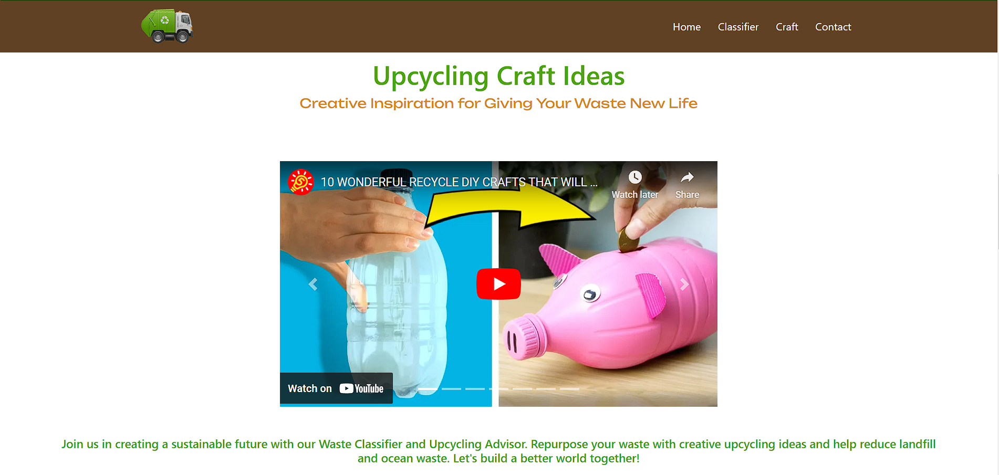

#  DOMESTIC WASTE RECOGNITION IN RURAL AREAS - Waste Classifier Project 🌍♻️

## Introduction 📝
DOMESTIC WASTE RECOGNITION IN RURAL AREAS is a Flask-based project that aims to classify different categories of waste using deep learning techniques. The project has been trained on a dataset containing more than 5000 images of waste items. It not only classifies the waste into seven different categories but also provides sections to craft waste items and promote their reuse. The ultimate goal of DOMESTIC WASTE RECOGNITION IN RURAL AREAS is to motivate people to recycle waste and raise awareness about the importance of recycling for the well-being of our planet. 🌱🌎


## Waste Classification ♻️🗑️
 DOMESTIC WASTE RECOGNITION IN RURAL AREAS utilizes deep learning algorithms to accurately classify waste items into the following seven categories:
1. Plastic 🥤
2. Glass 🍶
3. Metal 🧱
4. Paper 📄
5. Cardboard 📦
6. Organic 🥕
7. Miscellaneous 📦❔

The trained model is capable of analyzing images of waste items and predicting their corresponding category with high accuracy.


## Craft and Reuse ♻️🎨
DOMESTIC WASTE RECOGNITION IN RURAL AREAS goes beyond waste classification by providing sections that offer creative ideas and instructions for crafting waste items into useful and aesthetically pleasing objects. These ideas encourage users to reuse waste materials and reduce their environmental impact. By transforming waste into valuable items, DOMESTIC WASTE RECOGNITION IN RURAL AREAS aims to inspire users to think innovatively and contribute to a more sustainable future. ♻️🔨🖌️


## Motivation for Recycling Waste 🌍💪
Recycling waste plays a crucial role in preserving our planet's resources and protecting the environment. TrashTech emphasizes the significance of recycling by highlighting the potential consequences if we neglect this responsibility. Earth would suffer from the following consequences without proper waste recycling:
- Depletion of natural resources 🌳🏭
- Increased pollution and landfills 🏞️🗑️
- Destruction of ecosystems and wildlife habitats 🐦🐢🐝
- Climate change and global warming 🌡️🌍

By raising awareness about these issues, TrashTech encourages individuals to adopt sustainable practices and actively participate in recycling efforts.


## Requirements 📦🔧
To run the DOMESTIC WASTE RECOGNITION IN RURAL AREAS project, you need to have the following dependencies installed:

- Python 3.7+
- Flask 2.0.1
- TensorFlow 2.6.0
- Keras 2.6.0
- NumPy 1.21.2
- Pillow 8.4.0
- Gevent 22.10.2
- Werkzeug 2.2.2

You can install these dependencies by running the following command:

```bash
pip install -r requirements.txt
```

## Setup ⚙️🛠️
To set up the TrashTech project, follow these steps:

1. Clone the repository from GitHub:

  ```bash
 git clone https://github.com/LavanyaSurada/Garbage-Detection.git
 ```
 2. Navigate to the project directory:

```bash
cd 
```
3. Install the required dependencies using pip:
```bash
pip install -r requirements.txt
```
4. Run the Flask application:
```bash
python app.py
```
5. Open your web browser and visit http://localhost:5000 to access the DOMESTIC WASTE RECOGNITION IN RURAL AREAS application.

## Demo 📸🎥

To demonstrate the TrashTech project, follow these steps:

1. Access the TrashTech web application by running the Flask application:

```bash
python app.py
```
2. Open your web browser and visit http://localhost:5000 to access the Domestic Garbage Detection application.

3. Upload an image of a waste item to the application.

4. The waste classification model will predict the category of the waste item.

5. Explore the crafting and reuse sections to discover creative ideas for reusing waste items.

6. Get motivated to recycle waste and contribute to a more sustainable future!

## Conclusion 🌍🙌

DOMESTIC WASTE RECOGNITION IN RURAL AREAS is not just a waste classifier but a project that aims to inspire individuals to take action and make a positive impact on the environment. By correctly classifying waste items, promoting reuse, and motivating recycling, TrashTech aims to contribute to a cleaner, greener, and more sustainable future. Together, let's work towards a world where waste is seen as a valuable resource and recycling becomes a way of life. ♻️🌎🌱
